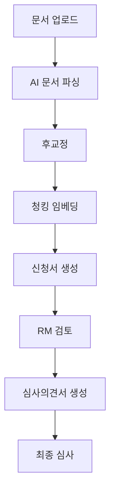

# AI 기반 기업여신 심사 자동화 시스템

[](./PRD.md)
[](./PRD.md)
[](./README.md)

## 🎯 프로젝트 개요

Azure Document Intelligence와 생성형 AI를 활용하여 기업여신 심사 프로세스를 80% 자동화하는 웹 시스템입니다. 기존 7-10일 소요 프로세스를 2-3일로 단축하여 70%의 시간 절약을 목표로 합니다.

### 🏗️ 시스템 아키텍처



### ✨ 주요 기능

- **8단계 자동화 워크플로우**: 신규등록부터 최종심사까지
- **실시간 진행 추적**: 각 단계별 상태 및 진행률 모니터링
- **AI 기반 분석**: 문서 파싱, 리스크 분석, 보고서 생성
- **인간 검증 시스템**: 후교정 및 RM/심사역 승인 프로세스
- **반응형 웹 디자인**: 데스크탑 및 모바일 지원

## 🚀 빠른 시작

### 필수 요구사항

- **웹 브라우저**: Chrome 88+, Firefox 85+, Safari 14+, Edge 88+
- **로컬 서버**: Python 3.x 또는 Node.js (개발용)

### 설치 및 실행

1. **저장소 클론**

```bash
git clone <repository-url>
cd Corp-Loan
```

2. **로컬 서버 실행**

```bash
# Python 사용
python3 -m http.server 8000

# 또는 Node.js 사용
npx http-server . -p 8000
```

3. **브라우저에서 접속**

```text
http://localhost:8000
```

### 📁 프로젝트 구조

```text
Corp-Loan/
├── 📄 index.html                    # 메인 대시보드 (루트 진입점) 🏠
├── 📁 app/                          # 애플리케이션 HTML 파일들 🆕
│   ├── 📁 loan-management/          # 대출 관리 관련 페이지들
│   │   ├── new-loan.html            # 신규 대출 등록
│   │   ├── loan-detail.html         # 대출 상세 정보
│   │   └── loan-approval-application.html # AI 신청서
│   ├── 📁 review-workflow/          # 검토 워크플로우 페이지들
│   │   ├── rm-review.html           # RM 검토
│   │   └── final-review.html        # 최종 심사
│   └── 📁 shared/                   # 공통 컴포넌트
├── 📁 templates/                    # HTML 템플릿 시스템 🆕
│   ├── base.html                    # 기본 페이지 템플릿
│   └── 📁 components/               # 재사용 가능한 HTML 컴포넌트
│       ├── header-main.html         # 메인 헤더
│       └── navigation-sub.html      # 서브 네비게이션
├── 📁 assets/                       # 정적 리소스
│   ├── 📁 css/                      # 스타일시트
│   │   ├── 📁 components/           # 컴포넌트별 CSS
│   │   │   └── dashboard.css        # 대시보드 전용 스타일
│   │   └── 📁 core/                 # 핵심 스타일
│   │       ├── main.css             # 메인 스타일 (전역)
│   │       ├── reset.css            # CSS 리셋
│   │       └── variables.css        # CSS 변수 정의
│   ├── 📁 images/                   # 이미지 파일
│   ├── 📁 js/                       # JavaScript 파일
│   │   ├── 📁 components/           # 컴포넌트별 JS
│   │   │   └── dashboard.js         # 대시보드 로직
│   │   ├── 📁 core/                 # 핵심 JavaScript
│   │   │   ├── template-manager.js  # 템플릿 관리 시스템
│   │   │   ├── page-utils.js        # 페이지 공통 유틸리티
│   │   │   └── workflow-manager.js  # 워크플로우 관리
│   │   └── 📁 services/             # 서비스 레이어
│   │       └── api-service.js       # API 통신 서비스
│   └── 📁 references/               # 참고 문서 및 데이터
├── 📁 scripts/                      # 빌드 및 유틸리티 스크립트 🆕
│   ├── build-html.js               # HTML 빌드 스크립트
│   └── fix-accessibility.js        # 접근성 자동 수정 스크립트
└── 📄 package.json                  # 프로젝트 의존성 & 스크립트
```

## 🔧 개발 가이드

### HTML 관리 명령어 🆕

```bash
# HTML 템플릿 빌드 (templates/ → *.html)
npm run build

# 템플릿 변경사항 자동 감지 및 빌드
npm run build:watch

# 빌드 후 개발 서버 실행 (포트 8000)
npm run dev

# 개발 서버만 실행 (빌드 안 함)
npm run serve

# 빌드된 HTML 파일들 삭제
npm run clean
```

### 🔄 8단계 워크플로우 매핑

| 단계 | 페이지 | 설명 |
|------|--------|------|
| 1단계 | `app/loan-management/new-loan.html` | 신규 대출 등록 |
| 2-4단계 | `app/loan-management/loan-detail.html` (parsing 탭) | 문서 파싱 → 후교정 → 청킹임베딩 |
| 5단계 | `app/loan-management/loan-approval-application.html` | AI 여신승인신청서 생성 |
| 6단계 | `app/review-workflow/rm-review.html` | RM 검토 및 승인 |
| 7-8단계 | `app/review-workflow/final-review.html` | AI 심사의견서 → 최종 심사 |

### Phase별 개발 현황

| Phase | 상태 | 설명 | 완료율 |
|-------|------|------|---------|
| **Phase 1** | ✅ 완료 | 기본 인프라 및 워크플로우 시스템 | 100% |
| **Phase 2** | 🔄 대기 | Stage 1: 파일 업로드 시스템 | 0% |
| **Phase 3** | ⏳ 계획 | Stage 2-3: 파싱 및 후교정 | 0% |
| **Phase 4** | ⏳ 계획 | Stage 4-5: 청킹 및 신청서 생성 | 0% |
| **Phase 5** | ⏳ 계획 | Stage 6-8: 검토 및 최종 심사 | 0% |

### 🧪 테스트 실행

Phase별 기능 테스트 페이지에서 자동화된 테스트를 실행할 수 있습니다:

```text
http://localhost:8000/tests/phase1-test.html
```

**테스트 항목:**

- ✅ 워크플로우 매니저 초기화
- ✅ 8단계 워크플로우 정의
- ✅ 로컬스토리지 데이터 영속성
- ✅ CSS 스타일 시스템
- ✅ 통계 데이터 생성

### 💻 개발 환경 설정

1. **에디터 설정**: VS Code + 다음 확장프로그램 권장
   - Live Server
   - HTML CSS Support
   - JavaScript (ES6) code snippets
   - Tailwind CSS IntelliSense

2. **기술 스택**

   - **Frontend**: HTML5, Vanilla JavaScript, Tailwind CSS
   - **Backend**: Node.js Express (별도 서버)
   - **Storage**: MinIO S3-compatible (파일 저장)
   - **AI Integration**: Azure Document Intelligence API
   - **Authentication**: JWT Bearer Token

3. **코딩 표준**

   - HTML: 시맨틱 HTML5, ARIA 속성 활용 (WCAG 2.1 AA 준수)
   - CSS: Tailwind CSS 우선, 커스텀 CSS 최소화
   - JavaScript: ES6+ 문법, 에러 핸들링 필수

4. **브랜치 전략**

   ```bash
   main                # 프로덕션 코드
   ├── develop         # 개발 브랜치
   ├── feature/phase2  # Phase 2 개발
   ├── feature/phase3  # Phase 3 개발
   └── hotfix/*        # 긴급 수정
   ```

## 📊 8단계 워크플로우

| 단계 | 이름 | 설명 | 예상 시간 |
|------|------|------|-----------|
| 1 | **신규대출등록** | 파일 업로드 및 기본 정보 입력 | 5분 |
| 2 | **문서파싱** | Azure Document Intelligence로 텍스트 추출 | 10분 |
| 3 | **후교정** | AI 추출 결과의 인간 검증 및 수정 | 15분 |
| 4 | **청킹임베딩** | 문서 청킹 및 벡터 임베딩 생성 | 5분 |
| 5 | **신청서생성** | AI 기반 여신승인신청서 자동 작성 | 10분 |
| 6 | **RM검토** | RM의 신청서 검토 및 편집 | 20분 |
| 7 | **의견서생성** | 심사역용 AI 분석 의견서 생성 | 10분 |
| 8 | **최종심사** | 심사역의 최종 승인/거부 결정 | 30분 |

**총 소요시간**: ~105분 (기존 7-10일 대비 **99% 단축**)

## 🎨 디자인 시스템

### 컬러 팔레트

```css
/* Primary Colors */
--primary-500: #3b82f6    /* 메인 브랜드 컬러 */
--success-500: #22c55e    /* 성공/완료 상태 */
--warning-500: #f59e0b    /* 주의/대기 상태 */
--error-500: #ef4444      /* 오류/실패 상태 */

/* Semantic Colors */
--stage-processing: var(--primary-500)
--stage-completed: var(--success-500)
--confidence-high: var(--success-500)   /* 신뢰도 >90% */
--confidence-medium: var(--warning-500) /* 신뢰도 70-90% */
--confidence-low: var(--error-500)      /* 신뢰도 <70% */
```

### 컴포넌트

- **버튼**: `.btn`, `.btn-primary`, `.btn-secondary`
- **카드**: `.card`, `.card-header`, `.card-body`, `.card-footer`
- **폼**: `.form-input`, `.form-label`, `.form-error`
- **워크플로우**: `.workflow-step`, `.step-icon`, `.step-title`

## 📈 성능 지표

### 목표 KPI

- **문서 처리 시간**: 2-3일 → 1시간 (**95% 단축**)
- **전체 심사 시간**: 7-10일 → 2-3일 (**70% 단축**)
- **분석 정확도**: **85%** 이상 (인간 RM과의 일치율)
- **사용자 만족도**: **4.0/5.0** 이상

### 기술 성능

- **페이지 로드 시간**: 3초 이내
- **브라우저 지원**: IE11+ 포함 주요 브라우저
- **반응형 지원**: 320px ~ 1920px 해상도
- **접근성**: WCAG 2.1 AA 준수

## 🔒 보안 고려사항

- **데이터 보호**: 민감한 기업정보 로컬스토리지 암호화
- **접근 제어**: 단계별 권한 관리 (RM, 심사역)
- **감사 로그**: 모든 수정사항 추적 및 기록
- **HTTPS 필수**: 프로덕션 환경에서 SSL/TLS 적용

## 📚 문서 및 참고자료

- **[PRD.md](./PRD.md)**: 상세 제품 요구사항 문서
- **[CLAUDE.md](./CLAUDE.md)**: Claude Code 개발 가이드
- **scripts/**: 빌드 및 유틸리티 스크립트
- **assets/references/**: 샘플 데이터 및 참고 문서

## 🤝 기여 가이드

### 커밋 메시지 형식

```text
[Phase N] type: description

예시:
[Phase 1] feat: Add workflow manager system
[Phase 2] fix: File upload validation error
[Phase 3] docs: Update API documentation
```

### Pull Request

1. feature 브랜치에서 작업
2. 테스트 통과 확인
3. 코드 리뷰 요청
4. develop 브랜치로 병합

## 📞 지원 및 문의

- **이슈 리포팅**: GitHub Issues 활용
- **개발 문의**: 프로젝트 관리자에게 연락
- **긴급 지원**: 별도 채널 활용

---

**마지막 업데이트**: 2024년 9월 26일
**현재 버전**: Phase 1 (v1.0.0)
**다음 릴리스**: Phase 2 - Stage 1 구현 예정
